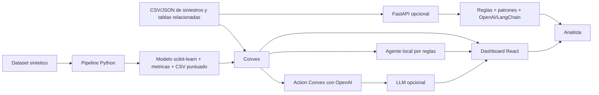

# Arquitectura

## Objetivo

El sistema prioriza siniestros para revision humana mediante un score hibrido
de posible fraude. El score combina un modelo supervisado entrenado con
scikit-learn, reglas de negocio explicables y un agente de consultas para el
analista.

## Componentes

## Flujo de datos

1. `ml/generate_synthetic_claims.py` genera datos anonimos de siniestros.
2. `ml/train_fraud_model.py` entrena `RandomForestClassifier`.
3. El modelo genera `fraud_probability` y `ml_risk_score`.
4. La pantalla `/importacion_csv` carga CSV/JSON por tabla hacia Convex.
5. Convex normaliza datos, valida campos minimos y evita duplicados.
6. Convex calcula reglas explicables y mezcla el score:
   - 55% score de modelo ML,
   - 45% score por reglas.
7. Si un registro no trae score ML, se usa el score por reglas.
8. El dashboard muestra semaforo, explicaciones, rankings y exportacion.
9. El agente responde consultas con OpenAI si hay `OPENAI_API_KEY`; si no,
   responde con el agente local basado en reglas.
10. La API FastAPI opcional expone analisis REST con:
    `score_final = score_reglas * 0.50 + score_patrones * 0.25 + score_ia * 0.25`.
    Esta API no reemplaza Convex; sirve para integrar modelos preentrenados via
    API y consumidores externos.

## Rutas de frontend

- `/`: dashboard principal con resumen, prioridades, datos demo y agente.
- `/importacion_csv`: importacion CSV/JSON y descarga de plantillas.
- `/casos`: bandeja de todos los casos procesados.
- `/ML_AGENTE`: explicacion del enfoque ML + reglas + agente.

## Funciones Convex principales

- `listWithRisk`
- `getSummary`
- `importPublicClaims`
- `importPolicies`
- `importInsureds`
- `importProviders`
- `importClaimDocuments`
- `askAnalystAssistant`
- `askAnalystAssistantWithLLM`
- `seedSyntheticData` para demos internas o carga sintetica desde backend.

## Endpoints FastAPI opcionales

- `GET /health`
- `POST /api/analysis/claim`
- `POST /api/analysis/batch`
- `GET /api/agent/top-risk`
- `GET /api/agent/explain/{claim_id}`
- `GET /api/agent/providers-alerts`
- `GET /api/agent/executive-summary`

## Decisiones tecnicas

- Convex se usa para persistencia, consultas reactivas, importacion y actions.
- FastAPI se agrega como backend paralelo para analisis REST, sin romper el
  frontend ni las funciones Convex existentes.
- El modelo se entrena offline en Python para cumplir el requisito de
  scikit-learn.
- Las reglas se mantienen visibles para trazabilidad y explicabilidad.
- La IA generativa no recibe credenciales desde el navegador; la API key vive
  como variable segura de Convex.
- El score no automatiza decisiones: solo prioriza revision.

## Escalabilidad futura

- Reemplazar dataset sintetico por historicos anonimizados.
- Publicar el modelo como API Python/FastAPI o batch scoring programado.
- Versionar modelos con fecha, dataset y metricas.
- Agregar auditoria de decisiones y feedback de analistas.
- Migrar consultas agregadas a indices/materializaciones si el volumen crece.
