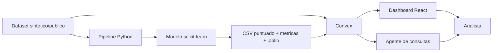

# Arquitectura

## Objetivo

El sistema prioriza siniestros para revision humana mediante un score hibrido
de posible fraude. El score combina un modelo supervisado entrenado con
scikit-learn y reglas de negocio explicables.

## Componentes

## Flujo de datos

1. `ml/generate_synthetic_claims.py` genera datos anonimos de siniestros.
2. `ml/train_fraud_model.py` entrena `RandomForestClassifier`.
3. El modelo genera `fraud_probability` y `ml_risk_score`.
4. Convex carga datos sinteticos ampliados o datos importados JSON/CSV.
5. Convex calcula reglas explicables y mezcla el score:
   - 55% score de modelo ML,
   - 45% score por reglas.
6. El dashboard muestra semaforo, explicaciones, rankings y exportacion.
7. El agente responde preguntas frecuentes de analistas y jurado.

## Decisiones tecnicas

- Convex se usa para demo funcional, persistencia y consultas reactivas.
- El modelo se entrena offline en Python para cumplir el requisito de
  scikit-learn.
- Las reglas se mantienen visibles para trazabilidad y explicabilidad.
- El score no automatiza decisiones: solo prioriza revision.

## Escalabilidad futura

- Reemplazar dataset sintetico por historicos anonimizados.
- Publicar el modelo como API Python/FastAPI o batch scoring programado.
- Versionar modelos con fecha, dataset y metricas.
- Agregar auditoria de decisiones y feedback de analistas.
- Migrar consultas agregadas a indices/materializaciones si el volumen crece.
